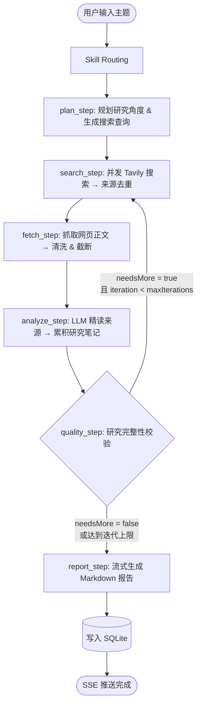

# Deep Research 用户说明书

> 版本：v1.0 · 类型：自动化研究 Agent 系统 

---

## 一、产品概述

**Deep Research** 是一款基于 LangGraph 构建的多轮自动研究代理系统。用户仅需输入一个研究主题，系统即可自动完成从「研究规划」到「报告产出」的全流程，并通过 SSE（Server-Sent Events）协议向前端实时推送研究进度与最终报告。

本系统面向以下典型场景：

- 市场调研与竞品分析
- 技术选型与可行性研究
- 学术主题的背景梳理
- GitHub 项目深度调研
- 数据分析与主题简报生成

---

## 二、核心特性

| 序号 | 特性 | 说明 |
|---|---|---|
| 1 | 自动化研究流水线 | 规划 → 搜索 → 抓取 → 分析 → 校验 → 报告，全流程自动化 |
| 2 | 多轮迭代质量校验 | 基于 LLM 的研究完整性判定，支持按需自动发起补充研究 |
| 3 | 实时流式输出 | 通过 SSE 协议向前端推送进度事件与 Markdown 报告内容 |
| 4 | 内容安全保障 | 抓取内容经过 boilerplate 清理与敏感信息脱敏后再进入 LLM |
| 5 | 可插拔 Skill 体系 | 支持深度研究、GitHub 调研、数据分析、主题简报等多种技能 |
| 6 | OpenAI 兼容 | 支持所有 OpenAI 协议兼容的 LLM 服务提供商 |
| 7 | 持久化历史记录 | 研究记录写入本地 SQLite，支持历史回溯 |

---

## 三、系统架构

### 3.1 目录结构

```text
deep-research/
├─ backend/src/
│  ├─ app/gateway/                    # HTTP + SSE 网关层
│  │  └─ routers/                     # 路由模块：research / github / data-analysis 等
│  └─ packages/harness/deepresearch/
│     ├─ agents/                      # LeadResearchAgent 与线程状态管理
│     ├─ config/                      # 环境变量加载与运行时配置
│     ├─ models/                      # LLM 工厂（OpenAI 兼容）
│     ├─ research/                    # 研究图核心逻辑
│     │   ├─ graph.ts                 #   - 工作流定义
│     │   ├─ search.ts                #   - 搜索执行
│     │   ├─ web-fetch.ts             #   - 网页抓取
│     │   ├─ sanitize.ts              #   - 内容清洗
│     │   └─ prompts.ts               #   - Prompt 模板
│     ├─ skills/                      # Skill 选择与运行时编排
│     └─ tools/                       # 内置工具（澄清、文件呈现等）
├─ frontend/src/                      # React + Vite 前端
│  ├─ components/                     # 控制面板、报告面板、工作区头
│  └─ lib/api.ts                      # 前后端通信
├─ skills/public/                     # 公共 Skill 目录
└─ .env                               # 环境变量配置文件
```

### 3.2 技术栈

- **运行时**：Node.js（ESM 模块）
- **AI 框架**：LangChain、LangGraph
- **前端**：React、Vite、自定义 Markdown 渲染
- **存储**：SQLite
- **搜索服务**：Tavily Search API

---

## 四、工作流程说明

### 4.1 工作流图示



### 4.2 各环节说明

| 环节 | 职责 | 输出 |
|---|---|---|
| Skill Routing | 根据用户输入匹配最合适的技能模板 | 选中的 Skill |
| plan_step | 将主题拆解为多个研究角度并生成搜索查询 | 查询列表 |
| search_step | 并发执行 Tavily 搜索并对来源去重 | 候选来源集合 |
| fetch_step | 抓取网页正文、进行清洗与长度截断 | 规整后的文档 |
| analyze_step | 调用 LLM 精读文档并累积研究笔记 | 研究笔记 |
| quality_step | 判定研究是否充分，决定是否进入下一轮 | 迭代决策 |
| report_step | 以流式方式生成最终 Markdown 报告 | 最终报告 |

### 4.3 质量校验与多轮迭代

质量校验由 `qualityNode` 执行，其判定机制如下：

1. **Prompt 引导**：将当前研究笔记、已执行轮次、已获取来源数发送给 LLM，要求其判断研究是否完整。
2. **结构化输出**：通过 `StructuredOutputParser` + Zod Schema 约束 LLM 返回以下结构：
   ```json
   { "needsMore": boolean, "newQueries": string[] }
   ```
3. **代码侧门控**：最终决策为 `needsMore = parsed.needsMore && iteration < maxIterations`，以硬性迭代上限作为兜底，防止无限循环。

> 默认 `maxIterations = 1`，即最多执行 2 轮研究（初始轮 + 1 轮补充）。可通过环境变量 `RESEARCH_MAX_ITERATIONS` 调整。

### 4.4 内容安全机制

- **`sanitize.ts`**：对抓取内容执行 boilerplate 去除、敏感词脱敏、结构清理，随后再送入 LLM。
- **`safeModelInvoke`**：区分两类异常——内容安全拦截（不重试）与瞬时网络错误（采用指数退避重试）。

---

## 五、安装与启动

### 5.1 环境准备

- Node.js 18 及以上
- 有效的 OpenAI 兼容 API Key
- 有效的 Tavily API Key

### 5.2 启动步骤

```bash
# 步骤 1：复制环境变量模板并填写密钥
cp .env.example .env
# 使用编辑器打开 .env，填入 OPENAI_API_KEY、TAVILY_API_KEY 等

# 步骤 2：安装依赖
npm install

# 步骤 3：启动后端网关（默认端口 8001）
npm run gateway

# 步骤 4：启动前端开发服务器
npm run frontend:dev
```

启动完成后，在浏览器访问前端地址即可开始使用。

---

## 六、配置项参考

### 6.1 LLM 配置

| 变量 | 默认值 | 说明 |
|---|---|---|
| `OPENAI_API_KEY` | — | OpenAI 兼容服务的 API Key |
| `OPENAI_BASE_URL` | — | OpenAI 兼容接口地址 |
| `LLM_MODEL` | `gpt-4o-mini` | 使用的模型名称 |
| `LLM_TEMPERATURE` | `0.2` | 采样温度，值越低越稳定 |

### 6.2 搜索与研究配置

| 变量 | 默认值 | 说明 |
|---|---|---|
| `TAVILY_API_KEY` | — | Tavily 搜索服务 API Key |
| `SEARCH_TOP_K` | `5` | 单条查询返回的结果数 |
| `SEARCH_CONCURRENCY` | `3` | 搜索请求的并发数 |
| `FETCH_MAX_PAGES` | `8` | 单次研究最多抓取的页面数 |
| `RESEARCH_MAX_ITERATIONS` | `1` | 最大补充搜索轮数（`0` 表示关闭质量检查） |
| `REQUEST_TIMEOUT_MS` | `12000` | 网络请求超时（毫秒） |

---

## 七、常见问题

**Q1：研究任务卡住或报告无输出？**
请检查 `OPENAI_API_KEY`、`TAVILY_API_KEY` 是否有效，以及网络是否可访问 LLM 与搜索服务。

**Q2：如何提升研究深度？**
可适当调大 `RESEARCH_MAX_ITERATIONS`、`SEARCH_TOP_K` 与 `FETCH_MAX_PAGES`，但会相应增加耗时与 Token 消耗。

**Q3：报告内容被截断或拒绝？**
可能触发了内容安全机制。请检查日志中是否存在安全拦截提示，必要时调整研究主题措辞。

---

## 八、附录

- 研究记录数据库路径：`backend/.deep-research/research-records.db`
- Skill 资源目录：`skills/public/`
- 扩展配置入口：`extensions-config.json`
