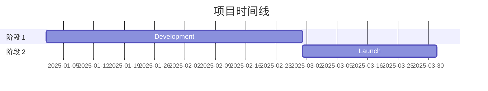
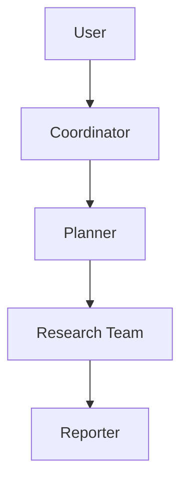
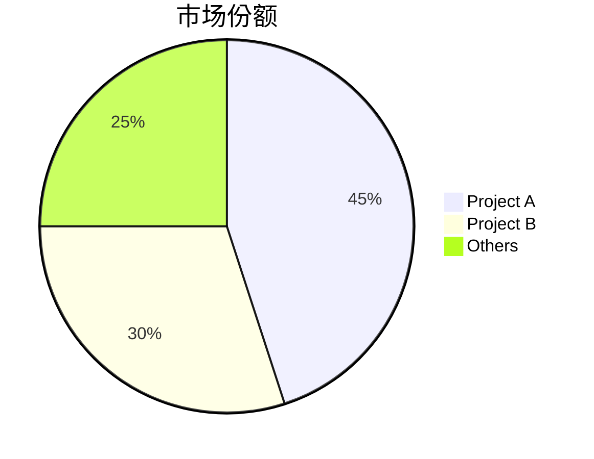

# GitHub 深度研究技能

结合 GitHub API、web_search、web_fetch 的多轮研究流程，用于生成完整 markdown 报告。

## 研究流程

- 第 1 轮：GitHub API
- 第 2 轮：信息发现
- 第 3 轮：深入调查
- 第 4 轮：深挖细节

## 核心方法

### 查询策略

**先广后深**：先跑 GitHub API，再做通用检索，随后根据发现逐步收敛。

```
第 1 轮：GitHub API
第 2 轮："{topic} overview"
第 3 轮："{topic} architecture", "{topic} vs alternatives"
第 4 轮："{topic} issues", "{topic} roadmap", "site:github.com {topic}"
```

**来源优先级**：
1. 官方文档/仓库（最高权重）
2. 技术博客（Medium、Dev.to）
3. 新闻报道（可信媒体）
4. 社区讨论（Reddit、HN）
5. 社交媒体（最低权重，仅用于情绪参考）

### 研究轮次

**第 1 轮 - GitHub API**  
直接执行 `scripts/github_api.py`，不要先 `read_file()`：
```bash
python /path/to/skill/scripts/github_api.py <owner> <repo> summary
python /path/to/skill/scripts/github_api.py <owner> <repo> readme
python /path/to/skill/scripts/github_api.py <owner> <repo> tree
```

**可用命令（`github_api.py` 最后一个参数）：**
- summary
- info
- readme
- tree
- languages
- contributors
- commits
- issues
- prs
- releases

**第 2 轮 - 信息发现（3-5 次 web_search）**
- 获取全局概览并识别关键术语
- 查找官网/官方仓库
- 识别主要参与者/竞品

**第 3 轮 - 深入调查（5-10 次 web_search + web_fetch）**
- 技术架构细节
- 关键事件时间线
- 社区情绪
- 对高价值链接用 web_fetch 抓取全文

**第 4 轮 - 深挖**
- 通过 commit 历史重建时间线
- 审阅 issue/PR 了解功能演进
- 检查贡献者活跃度

## 报告结构

遵循 `assets/report_template.md` 模板：

1. **元数据块** - 日期、置信度、研究对象
2. **执行摘要** - 2-3 句概览与关键指标
3. **时间线** - 分阶段演进与日期
4. **关键分析章节** - 主题化深挖
5. **指标与对比** - 表格、增长图
6. **优势与短板** - 平衡评估
7. **来源** - 分类引用
8. **置信度评估** - 按可信度分层陈述
9. **方法论** - 实际研究方法说明

### Mermaid 图

在有帮助时加入图示：

**时间线（Gantt）**：


**架构（流程图）**：


**对比（饼图/柱图）**：


## 置信度评分

依据来源质量分配置信度：

| 置信度 | 标准 |
|------------|----------|
| 高（90%+） | 官方文档、GitHub 数据、多个来源交叉印证 |
| 中（70-89%） | 单一可靠来源、近期文章 |
| 低（50-69%） | 社交媒体、未验证结论、过时信息 |

## 输出

将报告保存为：`research_{topic}_{YYYYMMDD}.md`

### 格式规范

- 中文内容：使用全角标点（，。：；！？）
- 技术术语：首次出现附 Wiki/官方文档 URL
- 表格：用于指标与对比
- 代码块：用于技术示例
- Mermaid：用于架构、时间线、流程

## 最佳实践

1. **先查官方来源** - 仓库、文档、公司博客
2. **用 commit/PR 核验日期** - 比新闻更可靠
3. **结论三角验证** - 至少 2 个独立来源
4. **标注冲突信息** - 不要隐藏矛盾
5. **区分事实与观点** - 明确标识推测
6. **关键：始终使用内联引用** - 外部结论后立即加 `[citation:Title](URL)`
7. **从搜索结果提取 URL** - web_search 返回 `{title, url, snippet}`，务必使用 `url`
8. **边研究边整理** - 不要拖到最后才汇总

### 引用示例

**好示例（有内联引用）：**
```markdown
The project gained 10,000 stars within 3 months of launch [citation:GitHub Stats](https://github.com/owner/repo).
The architecture uses LangGraph for workflow orchestration [citation:LangGraph Docs](https://langchain.com/langgraph).
```

**坏示例（无引用）：**
```markdown
The project gained 10,000 stars within 3 months of launch.
The architecture uses LangGraph for workflow orchestration.
```
