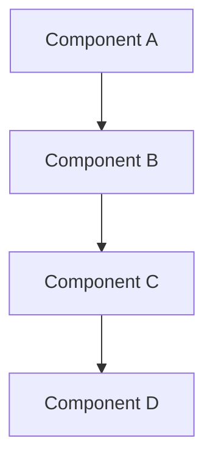

[!NOTE] 请使用用户的语言生成本报告。

# {TITLE}

- **研究日期：** {DATE}
- **时间戳：** {TIMESTAMP}
- **置信度等级：** {CONFIDENCE_LEVEL}
- **研究对象：** {SUBJECT_DESCRIPTION}

---

## 仓库信息

- **名称：** {REPOSITORY_NAME}
- **描述：** {REPOSITORY_DESCRIPTION}
- **URL：** {REPOSITORY_URL}
- **Stars：** {REPOSITORY_STARS}
- **Forks：** {REPOSITORY_FORKS}
- **开放 Issue：** {REPOSITORY_OPEN_ISSUES}
- **语言：** {REPOSITORY_LANGUAGES}
- **许可证：** {REPOSITORY_LICENSE}
- **创建时间：** {REPOSITORY_CREATED_AT}
- **更新时间：** {REPOSITORY_UPDATED_AT}
- **最近推送：** {REPOSITORY_PUSHED_AT}
- **Topics：** {REPOSITORY_TOPICS}

---

## 执行摘要

{EXECUTIVE_SUMMARY}

**重要**：每条结论后都要使用 `[citation:Title](URL)` 内联引用。示例：
"该项目在 3 个月内获得 1 万 star [citation:GitHub Stats](https://github.com/owner/repo)。"

---

## 完整时间线（按时间顺序）

### 阶段 1：{PHASE_1_NAME}

#### {PHASE_1_PERIOD}

{PHASE_1_CONTENT}

### 阶段 2：{PHASE_2_NAME}

#### {PHASE_2_PERIOD}

{PHASE_2_CONTENT}

### 阶段 3：{PHASE_3_NAME}

#### {PHASE_3_PERIOD}

{PHASE_3_CONTENT}

---

## 关键分析

**重要**：每个分析点都需要内联引用 `[citation:Title](URL)` 支撑。

### {ANALYSIS_SECTION_1_TITLE}

{ANALYSIS_SECTION_1_CONTENT}

### {ANALYSIS_SECTION_2_TITLE}

{ANALYSIS_SECTION_2_CONTENT}

---

## 架构 / 系统概览



{ARCHITECTURE_DESCRIPTION}

---

## 指标与影响分析

### 增长轨迹

```
{METRICS_TIMELINE}
```

### 关键指标

| 指标 | 数值 | 评估 |
|--------|-------|------------|
| {METRIC_1} | {VALUE_1} | {ASSESSMENT_1} |
| {METRIC_2} | {VALUE_2} | {ASSESSMENT_2} |
| {METRIC_3} | {VALUE_3} | {ASSESSMENT_3} |

---

## 对比分析

### 特性对比

| 特性 | {SUBJECT} | {COMPETITOR_1} | {COMPETITOR_2} |
|---------|-----------|----------------|----------------|
| {FEATURE_1} | {SUBJ_F1} | {COMP1_F1} | {COMP2_F1} |
| {FEATURE_2} | {SUBJ_F2} | {COMP1_F2} | {COMP2_F2} |
| {FEATURE_3} | {SUBJ_F3} | {COMP1_F3} | {COMP2_F3} |

### 市场定位

{MARKET_POSITIONING}

---

## 优势与短板

### 优势

{STRENGTHS}

### 待改进点

{WEAKNESSES}

---

## 关键成功因素

{SUCCESS_FACTORS}

---

## 来源

### 一手来源

{PRIMARY_SOURCES}

### 媒体报道

{MEDIA_SOURCES}

### 学术 / 技术来源

{ACADEMIC_SOURCES}

### 社区来源

{COMMUNITY_SOURCES}

---

## 置信度评估

**高置信度（90%+）结论：**
{HIGH_CONFIDENCE_CLAIMS}

**中置信度（70-89%）结论：**
{MEDIUM_CONFIDENCE_CLAIMS}

**较低置信度（50-69%）结论：**
{LOW_CONFIDENCE_CLAIMS}

---

## 研究方法

本报告基于以下方法编制：

1. **多源网络检索** - 广泛发现与定向查询
2. **GitHub 仓库分析** - 提交、Issue、PR、活跃度指标
3. **内容抽取** - 官方文档、技术文章、媒体报道
4. **交叉验证** - 在独立来源间核验
5. **时间线重建** - 基于带时间戳的数据构建演进路径
6. **置信度评分** - 按来源可靠性加权结论

**研究深度：** {RESEARCH_DEPTH}
**时间范围：** {TIME_SCOPE}
**地理范围：** {GEOGRAPHIC_SCOPE}

---

**报告生成方：** DeerFlow GitHub 深度研究
**日期：** {REPORT_DATE}
**报告版本：** 1.0
**状态：** 完成
